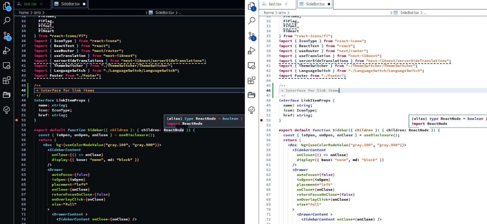

# Monokai HC Extreme

## A new high contrast clear experience 
This theme is tailored with the beautiful github high contrast theme for the editor joined with powerful monokai code highlight
## Preview
[Link](https://vscodethemes.com/e/zibro.monokai-hc-extreme/monokai-hc-extreme-dark?language=javascript)

## Install

1. Go to [VS Marketplace](https://marketplace.visualstudio.com/items?itemName=Zibro.monokai-hc-extreme).
2. Click on the "Install" button.
3. Then [select a theme]
    - `Monokai HC Extreme light`
    - `Monokai HC Extreme dark`
   

## Override this theme

To override this (or any other) theme in your personal config file, please follow the guide in the [color theme](https://code.visualstudio.com/api/extension-guides/color-theme) documentation. This is handy for small tweaks to the theme without having to fork and maintain your own theme. 

