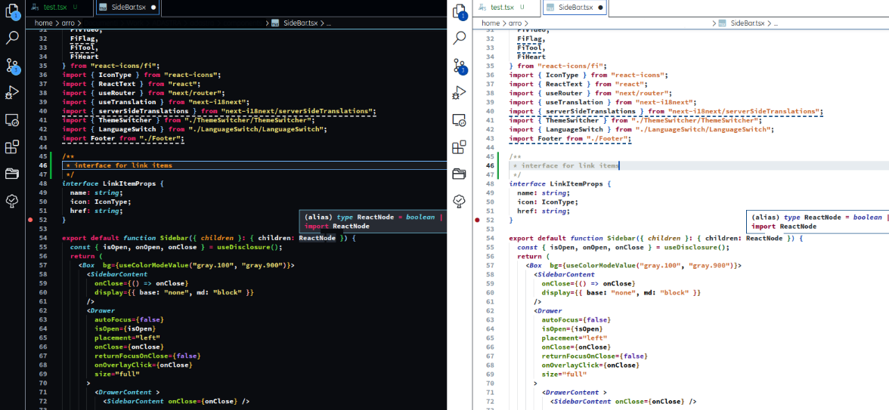

# Monokai HC Extreme

## A new high contrast clear experience 
This theme is tailored with the beautiful github high contrast theme for the editor joined with powerful monokai code highlight
## Preview
[Link](https://vscodethemes.com/e/zibro.monokai-hc-extreme/monokai-hc-extreme-dark?language=javascript)

## Install

1. Go to [VS Marketplace](https://marketplace.visualstudio.com/items?itemName=Zibro.monokai-hc-extreme).
2. Click on the "Install" button.
3. Then [select a theme]
    - `Monokai HC Extreme light`
    - `Monokai HC Extreme dark`
   

## Language highlighting

Both variants enable semantic highlighting and include additional syntax rules for **C#**, **TypeScript/TSX**, **React (JSX/TSX)**, **Vue**, **Angular**, **Go**, **Rust**, **Swift** and **Bash**. Types, parameters, properties, constants and methods have consistent semantic colors; template bindings and embedded expressions keep their own syntax highlighting.

| Language | Additional highlighting |
| --- | --- |
| C# | Records, delegates, fields, extension methods, XML documentation and interpolated strings |
| TypeScript/TSX | Conditional/mapped types, JSX components and props, JSDoc and readonly parameter properties |
| React | Component/native tag distinction, props, fragments, expression boundaries, quoted prop-object keys and JSX/TSX parity |
| Vue | Directives, shorthand bindings, slots, interpolations and embedded TypeScript/SCSS |
| Angular | Property/event/two-way bindings, pipes, control flow and inline templates |
| Go | Builtin functions and types, import aliases, interfaces and format placeholders |
| Rust | Lifetimes, macros, attributes, associated types and ownership/unsafe modifiers |
| Swift | Protocols, associated types, argument labels, attributes and compiler directives |
| Bash | Variable expansion, positional/special parameters, substitutions, command flags and heredocs |

The dark variant keeps the classic Monokai palette. The light variant uses darker counterparts for high contrast on white, including more readable comments and strings.

| Syntax role | Dark | Light |
| --- | --- | --- |
| Keywords and operators | Pink `#F92672` | Deep pink `#AC154C` |
| Types and properties | Cyan `#66D9EF` | Deep cyan `#005466` |
| Functions and methods | Green `#A6E22E` | Deep green `#2F6100` |
| Parameters and decorators | Orange `#FD971F` | Burnt orange `#8A451F` |
| Constants, numbers and escapes | Purple `#AE81FF` | Deep purple `#552AA3` |
| Strings | Yellow `#E6DB74` | Ochre `#794E00` |
| Comments | Orange `#FD971F` | Gray-green `#555B50` |

Every color in the light variant's semantic syntax palette has at least **7:1 contrast against the white editor background**. Selection, search and other editor overlays use their own backgrounds.

For semantic language support, use **C#** (`ms-dotnettools.csharp`), **Vue - Official** (`Vue.volar`), **Angular Language Service** (`Angular.ng-template`), **Go** (`golang.go`), **rust-analyzer** (`rust-lang.rust-analyzer`) or **Swift** (`swiftlang.swift-vscode`) in a configured project. TypeScript and React JSX/TSX support are built into VS Code; React types in your project refine hook, callback, state and ref classifications. Bash highlighting uses its built-in TextMate grammar. The theme styles tokens supplied by the language services; the available semantic detail depends on those extensions and your project configuration.

See [the highlighting examples and verification guide](examples/README.md) and the separate analyses for [Go](docs/languages/go.md), [Rust](docs/languages/rust.md), [Swift](docs/languages/swift.md), [Bash](docs/languages/bash.md), [TypeScript](docs/languages/typescript.md) and [React](docs/languages/react.md).

## Development and publishing

With Node.js 22 or newer, run `npm ci`, `npm run check` and `npm run package` to validate and build a VSIX. Pushing a matching version tag, such as `v1.4.0`, publishes the extension to the Marketplace and attaches the VSIX to a GitHub Release.

See [the publishing guide](docs/PUBLISHING.md) for the `VSCE_PAT` repository secret and release commands.

## Override this theme

To override this (or any other) theme in your personal config file, please follow the guide in the [color theme](https://code.visualstudio.com/api/extension-guides/color-theme) documentation. This is handy for small tweaks to the theme without having to fork and maintain your own theme. 
